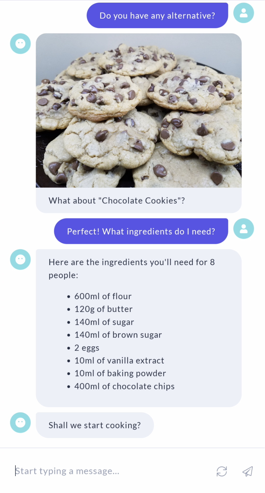
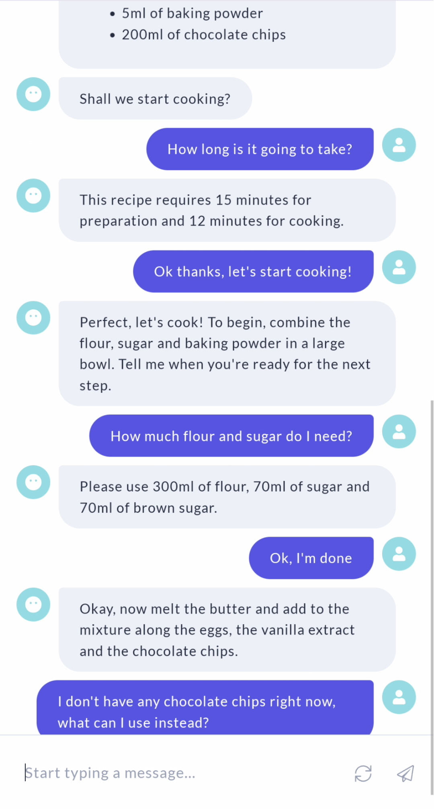

# Cooking Assistant with Rasa
A *conversational agent* developed with [Rasa](https://rasa.com/) to help searching and preparing food recipes. Check the [report](report.pdf) for more details.

The NLU data is generated with [Chatette](https://github.com/SimGus/Chatette) and the recipes are provided by [justthedarnrecipe.com](https://justthedarnrecipe.com/).

<div align="center">
    
    
    
</div>


## Get started
- Install the required dependencies and models:
    ```shell
    pip install -r requirements.txt
    python -m spacy download en_core_web_md
    ```
- Regenerate the NLU data and train the Rasa pipeline:
    ```shell
    python generate_data.py
    python -m rasa train
    ```
- In two separate terminals, run the actions server and the trained model:
    ```shell
    python -m rasa run actions
    python -m rasa shell
    ```


## Run on Google Assistant
- Setup a new project on the [Google actions console](https://console.actions.google.com/).
- In two separate terminals, run the actions server and the trained model:
    ```shell
    python -m rasa run actions
    python -m rasa run --enable-api -p 5004
    ```
- Install [NGrok](https://ngrok.com/) and run `ngrok http 5004` to expose the local Rasa API server.
- Copy the NGrok url in the two `url` fields in `action.json` as `{url}/webhooks/google_assistant/webhook`.
- Install the [Google actions CLI](https://developers.google.com/actions/tools/gactions-cli) and run `gactions update --action_package action.json --project {PROJECT_ID}` to deploy on Google Assistant using the project id created in step 1.
- Run `gactions test --action_package action.json --project {PROJECT_ID}` to enable testing of your action.

## Hyperparameter optimization
To run an hyperparameter search:

- Change the hyperparameters to use in `config.hyperopt.yml`, under the `hyperparams` key.
- Run the `python hyperopt.py -n [N_ITERATIONS]` script.

For each configuration 3 runs will be executed, using different held-out fractions of the training data for evaluation. The configurations files, the trained models and the final evaluation results can be then found in the `hyperopts` directory.
